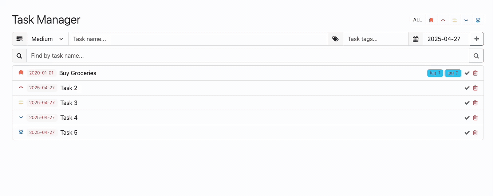

challenge:
- **Task Finder**:
  - Build a new form with a search input.
  - Convert the input value into a case-insensitive RegExp.
  - Use this RegExp to filter the tasks array via a new TaskManager attribute in the render method.
- **Task Tags**:
  - Add a new input field tags to the task form.
  – Convert the tags string from the form into a cleaned array (e.g., trim whitespace, convert to lowercase, remove empty values).

  